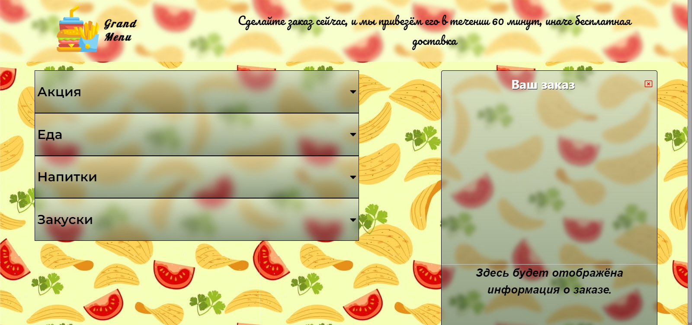
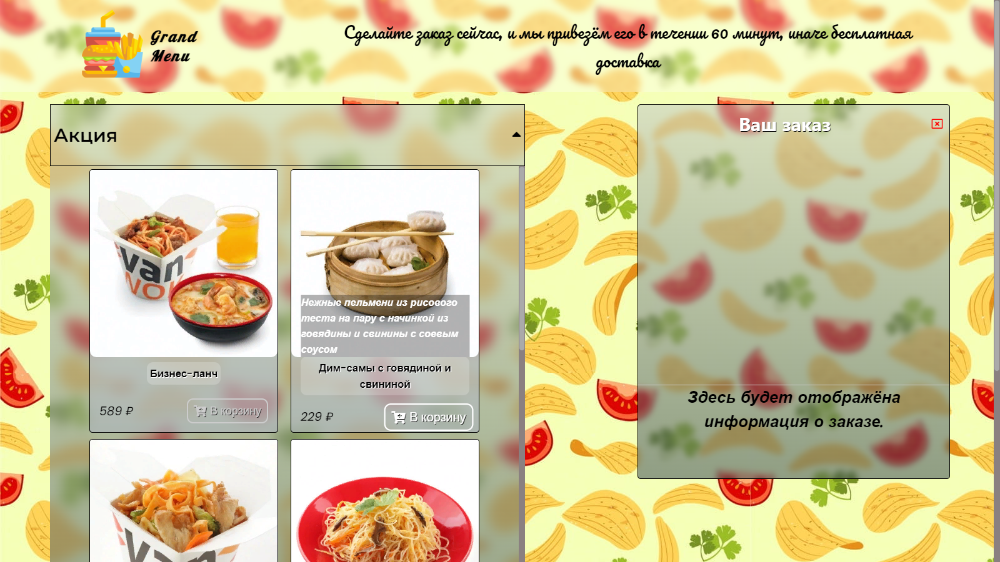
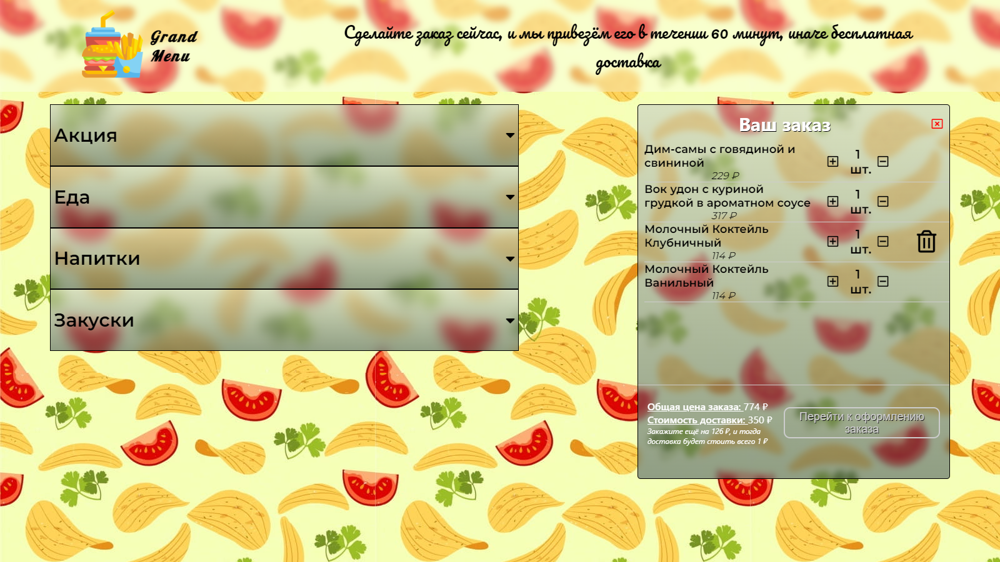
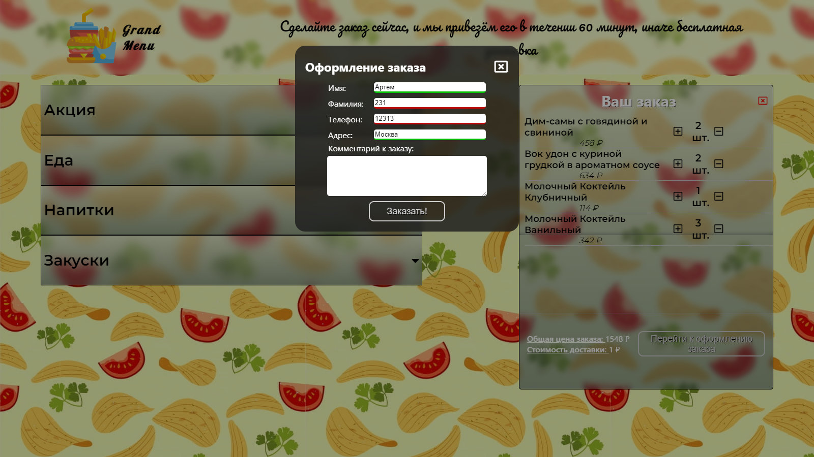

# Grand Menu

Основная идея приложения - заказ различной еды из магазина.

### _Полный экран_

Товары магазина расположены в аккардионе в левой части экрана.

----

### _Добавление товара_

Заказ осуществляется через кнопку **В корзину**. При наведении на товар выезжает его описание.

-----

### _Корзина товаров_

В правой части экрана присутствует корзина, в которую помещаются выбранные товары, а так же ведётся подсчет общей цены. Из корзины можно увеличить\уменьшить кол-во товаров, а так же полностью их удалить.

-----

### _Оформление заказа_

После того, как все необходимые товары были добавлены в корзину, при нажатии на кнопку **Перейти к оформлению заказа** появляется всплывающее окно, в котором нужно заполнить поля, в случае ввода неккоретных данных в инпуты, они будут подсвечиваться красным цветом.

***Приложение написанно на: JavaScript, SCSS, React***

